# Palqueate — Arquitectura de Base de Datos (PostgreSQL)

> Diseño relacional para llevar Palqueate de su almacenamiento local (demo) a un
> **backend real, centralizado y respaldado** (cubre RNF-12, RNF-16 y la
> sección 9 de `REQUERIMIENTOS.md`). El esquema representa **toda** la aplicación
> descrita en `docs/`: catálogo, reservas con control de concurrencia, cuentas,
> verificación de palcos, finanzas y —además de las tablas funcionales— una capa
> completa de **trazabilidad** (auditoría, logs de acceso y seguridad).

| | |
|---|---|
| **Motor** | PostgreSQL 18 (usa `uuidv7()` nativo para las PK) |
| **Esquemas** | `palqueate` (negocio) · `audit` (trazabilidad) |
| **Script** | `db/schema.sql` (único, autocontenido) |
| **Convención de nombres** | identificadores en inglés (como la API), comentarios en español |

---

## 1. Cómo aplicar

```bash
# Sobre una base vacía:
psql "$DATABASE_URL" -v ON_ERROR_STOP=1 -f db/schema.sql
```

`db/schema.sql` es un **único script** que crea todo el modelo en una sola
transacción y en el orden de dependencias correcto: dependencias hacia adelante
se cierran con `ALTER TABLE` (p. ej. `users.fav_stadium_id` apunta a `stadiums`).
El archivo está organizado internamente en bloques (`## 0001 … 0012`) para
facilitar su lectura; cada bloque corresponde a un área del modelo.

---

## 2. Principios de diseño

1. **Fuente única de la verdad del precio y el stock.** El cliente nunca envía
   precios ni totales (API §23): el subtotal, la comisión (RN-01) y la
   disponibilidad de butacas se calculan contra el modelo. `platform_config`
   centraliza las reglas (comisión, TTL de holds, mínimos de publicación) para
   ajustarlas sin tocar código (RNF-17).
2. **Inmutabilidad de la reserva.** `order_items` guarda *snapshots* (título del
   palco, etiqueta del evento, precio, período). Una reserva pagada es un
   registro histórico que no cambia aunque el palco o el evento se editen luego.
3. **Concurrencia correcta por construcción.** El anti-doble-venta no depende de
   la aplicación: lo impone un **índice único parcial** sobre `seat_reservations`
   por ámbito (función / temporada). Dos compras simultáneas del mismo asiento →
   una falla con violación de unicidad (el `409 Conflict` de la API §4).
4. **Seguridad y confidencialidad de datos.** Contraseñas, tokens, datos
   bancarios y documentos viven **separados** del perfil/listado, cifrados o
   tokenizados, y **nunca** se exponen en endpoints públicos ni se loguean en
   claro (RNF-14, RNF-15, API §5.4).
5. **Trazabilidad de primer nivel.** Toda mutación es auditable (quién, qué,
   cuándo, antes/después); todo request queda en el log de acceso; los eventos
   sensibles, en el log de seguridad. Además, entidades clave llevan bitácora
   propia (`palco_status_history`) e historial (revisiones, holds).
6. **Preparado para crecer (RNF-18).** `countries`, `currencies` y `seasons` son
   entidades, no constantes: habilitan multipaís, multimoneda y multi-temporada
   sin rediseñar.

---

## 3. Convenciones transversales

- **PK**: `uuid` opaco y **ordenado por tiempo** (`uuidv7()`, nativo en PG18); el
  backend los genera, el front no los inventa (API §1). UUIDv7 mejora la
  localidad de índice frente al v4 aleatorio (inserciones casi secuenciales) sin
  exponer un contador. Los logs de alto volumen usan `bigint` de identidad.
- **Dinero**: dominio `money_amount` = `bigint` ≥ 0, **sin decimales** (UYU); la
  moneda viaja en columnas `currency` (default `UYU`) — RN-14, API §1.
- **Tiempo**: siempre `timestamptz` (UTC). Los campos "humanos" del front
  (`month/day/dow/time`) se **derivan** de `event_occurrences.starts_at`; no se
  persisten redundantes.
- **`created_at` / `updated_at`** en toda tabla mutable; `updated_at` se mantiene
  por trigger (`set_updated_at`).
- **Borrado lógico** (`deleted_at`) en entidades que no deben perderse (usuarios,
  estadios, eventos, palcos); los índices únicos son parciales (`WHERE
  deleted_at IS NULL`) para permitir reutilización.
- **`created_by` / `updated_by`** en entidades operadas por humanos (estadios,
  eventos, palcos) para trazabilidad sin recurrir al log.

---

## 4. Mapa de bloques de `schema.sql`

| # | Bloque | Contenido |
|---|--------|-----------|
| 0001 | `foundation` | Extensiones, esquemas, dominios (`money_amount`, `email`…), enums, `set_updated_at` |
| 0002 | `reference_data` | `platform_config`, países, monedas, temporadas, comodidades, tipos de evento, **catálogo de botana**, roles, definición de campos verificables, `commission_for()` |
| 0003 | `identity_and_media` | `media_assets`, `users`, `auth_credentials`, `user_roles`, preferencias, medios de pago tokenizados, facturación, `sessions` |
| 0004 | `stadiums_and_events` | `stadiums`, `events`, `event_occurrences`, `event_images` |
| 0005 | `palcos` | `palcos`, `palco_modes`, `palco_seats`, co-propietarios, `palco_payout` (cifrado), documentos, fotos, `palco_status_history` |
| 0006 | `verification` | `palco_reviews`, `palco_review_field_flags` (RD-08) |
| 0007 | `cart_holds_availability` | `carts`, `cart_items`, `holds`, **`seat_reservations`** (núcleo anti-doble-venta) |
| 0008 | `orders_payments_payouts` | `orders`, `order_items`, `order_item_seats`, `snack_orders`, `snack_items`, `payments`, `payouts`, idempotencia |
| 0009 | `engagement_and_notifications` | Vistas a palcos, favoritos, calificaciones, `notifications` (outbox) |
| 0010 | `audit_logging` | `audit.access_log` (particionado), `audit.audit_log`, `audit.security_log`, retención |
| 0011 | `functions_and_triggers` | Bitácora de estados, validación RN-09, `expire_holds()`, disponibilidad, rating |
| 0012 | `views` | Catálogo público, CRM, métricas del palquista, finanzas |
| 0013 | `discounts` | `discount_codes` (programables), `discount_redemptions`, `validate_discount()`, `v_discount_usage` |

---

## 5. Modelo entidad-relación (resumen)

```mermaid
erDiagram
  countries ||--o{ stadiums : ""
  countries ||--o{ users : ""
  stadiums  ||--o{ events : ""
  stadiums  ||--o{ palcos : ""
  event_types ||--o{ events : ""
  events    ||--o{ event_occurrences : "1..N funciones"
  events    ||--o{ event_images : ""

  users ||--|| auth_credentials : ""
  users ||--o{ user_roles : ""
  roles ||--o{ user_roles : ""
  users ||--|| user_notification_prefs : ""
  users ||--o{ user_payment_methods : ""
  users ||--o{ sessions : ""
  media_assets ||--o{ users : "photo"

  users ||--o{ palcos : "owner"
  palcos ||--o{ palco_modes : ""
  palcos ||--o{ palco_seats : ""
  palcos ||--o{ palco_co_owners : ""
  palcos ||--|| palco_payout : "confidencial"
  palcos ||--o{ palco_documents : "confidencial"
  palcos ||--o{ palco_images : ""
  palcos ||--o{ palco_status_history : ""
  palcos ||--o{ palco_reviews : ""
  palco_reviews ||--o{ palco_review_field_flags : ""
  palco_review_field_defs ||--o{ palco_review_field_flags : ""

  users ||--o{ carts : ""
  sessions ||--o{ carts : "anónimo"
  carts ||--o{ cart_items : ""
  cart_items ||--|| holds : ""
  holds ||--o{ seat_reservations : "held"
  palcos ||--o{ seat_reservations : ""
  event_occurrences ||--o{ seat_reservations : "seatEvent"
  seasons ||--o{ seat_reservations : "anual"

  users ||--o{ orders : ""
  orders ||--o{ order_items : ""
  order_items ||--o{ order_item_seats : ""
  order_items ||--o{ seat_reservations : "sold"
  orders ||--o{ snack_items : "snacks iniciales"
  orders ||--o{ snack_orders : "compras posteriores"
  snack_orders ||--o{ snack_items : ""
  orders ||--o{ payments : ""
  snack_orders ||--o{ payments : ""
  orders ||--o{ payouts : ""
  palcos ||--o{ payouts : ""
  food_categories ||--o{ food_items : ""
  food_items ||--o{ snack_items : ""
  discount_codes ||--o{ discount_redemptions : ""
  discount_codes ||--o{ orders : "código aplicado"
  orders ||--|| discount_redemptions : ""

  palcos ||--o{ palco_view_events : ""
  palcos ||--o{ palco_favorites : ""
  palcos ||--o{ palco_ratings : ""
  users  ||--o{ notifications : ""
```



---

## 6. El sistema de reservas y la concurrencia (lo más delicado)

La disponibilidad se gestiona **por modalidad** (RN-11) y el bloqueo es
**atómico** (API §4). La pieza clave es `seat_reservations`, la tabla de
**bloqueos vivos**: una fila por butaca bloqueada, en estado `held` (hold activo)
o `sold` (venta confirmada).

- Tres ámbitos independientes, cada uno con su índice único parcial:
  - `seatEvent` → único `(palco_id, occurrence_id, seat_number)`
  - `seatYear`  → único `(palco_id, season_id, seat_number)`
  - `palcoYear` → único `(palco_id, season_id)` (palco entero, sin asiento)
- **Agregar al carrito** (`POST /cart/items`) inserta el hold y sus filas
  `held`. Si el asiento ya está bloqueado → violación de unicidad → `409`.
- **Liberar / vencer** elimina las filas `held` (el historial queda en `holds`).
  `expire_holds()` corre por job y de forma perezosa antes de leer disponibilidad.
- **Checkout** (`POST /orders`) revalida los holds y convierte `held` → `sold`
  dentro de la misma transacción que crea la orden.
- **Disponibilidad** = `seat_count − taken`, donde `taken` =
  `taken_seats(palco, mode, season, occurrence)` (cuenta `sold` + `held` vigente).

> Probado: dos inserciones del mismo asiento ⇒ la segunda falla; al vencer el
> hold, el asiento vuelve a estar libre.

---

## 7. Seguridad, privacidad y trazabilidad

**Aislamiento de datos sensibles**

| Dato | Dónde vive | Tratamiento |
|------|-----------|-------------|
| Contraseña | `auth_credentials.password_hash` | Hash (argon2id); nunca en claro (RNF-15) |
| Token de sesión | `sessions.token_hash` | Sólo el hash (API §5.4) |
| Tarjeta | `user_payment_methods` / `payments` | Sólo `brand` + `last4` + token; nunca PAN/CVV |
| Cuenta bancaria | `palco_payout.account_enc` | Cifrado en reposo + `account_last4` para mostrar |
| Documentos (CI, título) | `media_assets (is_sensitive)` + `palco_documents` | Confidenciales; nunca públicos (API §17, RNF-14) |

**Los tres flujos de logging** (API §5), en el esquema `audit`:

- `access_log` — una fila por request HTTP. **Particionada por mes** para rotar
  con la retención de 30 días.
- `audit_log` — una fila por mutación de dominio (`before`/`after` saneados),
  con catálogo de acciones (`audit_actions`). Retención 365 días.
- `security_log` — `login_failed`, `forbidden`, `rate_limited`, `hold_conflict`…
  Retención 365 días.

Los payloads llegan **ya saneados/enmascarados** desde la aplicación; el modelo
documenta la política en `audit.retention_policy` y la redacción en API §5.4.

**Trazabilidad de dominio adicional** (más allá de los logs): `palco_status_history`
(cada transición de estado), `palco_reviews` (historial de verificaciones),
`holds` (ciclo completo del bloqueo) y `created_by`/`updated_by` en las entidades
operadas por admins/palquistas.

---

## 8. Trazabilidad requerimientos / endpoints → tablas

| Requerimiento / Endpoint | Tablas principales |
|--------------------------|--------------------|
| RD-01 estadios · `GET/POST /stadiums` | `stadiums` |
| RD-02 eventos · `GET/POST /events` | `events`, `event_occurrences`, `event_images`, `event_types` |
| RD-03 palcos · `GET/POST /palcos` | `palcos`, `palco_modes`, `palco_seats`, `palco_co_owners`, `palco_payout`, `palco_documents`, `palco_images` |
| RD-04 ocupación de butacas (RN-11) | `seat_reservations` (+ `taken_seats()`) |
| RD-05 cuentas · `/accounts`, `/me` | `users`, `auth_credentials`, `user_roles`, `user_notification_prefs`, `user_payment_methods`, `user_billing` |
| Sesiones / login (multi-dispositivo, rotación) | `sessions` (`device_label`, `replaced_by_session_id`), `rotate_session()` |
| RD-06 reservas · `POST /orders` | `orders`, `order_items`, `order_item_seats`, `snack_items` (iniciales), `payments`, `payouts` |
| RD-07 catálogo de botana | `food_categories`, `food_items` |
| Snacks · `POST /orders/{code}/snacks` | `snack_orders`, `snack_items`, `payments`, `v_food_revenue` |
| RD-08 detalle de verificación | `palco_reviews`, `palco_review_field_flags`, `palco_review_field_defs` |
| Carrito y holds (API §4, §31-34) | `carts`, `cart_items`, `holds`, `seat_reservations` |
| RN-01 comisión / RN-02 payout | `platform_config`, `commission_for()`, `orders.fee`, `payouts` |
| Códigos de descuento (programables) | `discount_codes`, `discount_redemptions`, `validate_discount()`, `v_discount_usage` |
| RN-03 visibilidad del catálogo | `v_public_palcos` (índice parcial `ix_palcos_public`) |
| RN-04/05/07/08/09 ciclo de verificación | `palcos.status`, `palco_status_history`, `palco_reviews` |
| RN-13 acceso admin | `roles`, `user_roles`, `is_admin()` |
| RF-39 métricas del palquista · `/owner/metrics` | `v_owner_palco_metrics`, `palco_view_events`, `palco_favorites` |
| RF-46/48/49 CRM, finanzas, dashboard · `/admin/*` | `v_client_crm`, `v_finance_by_stadium`, `v_monthly_sales`, `v_modality_mix` |
| RF-32 preferencias / notificaciones | `user_notification_prefs`, `notifications` |
| API §5 logging | `audit.access_log`, `audit.audit_log`, `audit.security_log` |

---

## 9. Códigos de descuento

`discount_codes` modela cupones **programables**: cada código es porcentual
(`percent_off`, 0..1) o de **valor fijo** (`amount_off`), con **ventana de
validez** (`starts_at`/`ends_at`, programación entrada/salida), interruptor
manual (`is_active`), **mínimo de compra** (`min_subtotal`), **tope** del
descuento (`max_discount`, útil para porcentuales) y **límites de uso** (total
`max_redemptions` y por usuario `max_per_user`, con contador `times_redeemed`).

`max_redemptions` son las **"existencias"** del código (cupo total; `NULL` =
ilimitado). Ej.: `PalMundial` con `max_redemptions = 300`. El límite es **duro y
atómico**: el CHECK `chk_within_max_redemptions` (más el bloqueo de fila del
trigger de conteo) hace imposible la **sobreventa** aunque haya checkouts
concurrentes; el uso #301 hace rollback. `v_discount_usage.remaining` expone las
existencias restantes.

- **La plataforma absorbe el descuento**: la comisión (RN-01) y el payout
  (RN-02) se calculan sobre el **subtotal completo**; el código sólo reduce lo
  que paga el hincha (`total = subtotal + fee − discount_total`). El costo sale
  del margen de Palqueate, sin afectar al palquista.
- `validate_discount(code, subtotal, user)` valida ventana, estado, mínimo y
  límites, y devuelve el monto a descontar (ya con su tope). El checkout la usa
  dentro de su transacción para evitar carreras.
- `discount_redemptions` es el libro de usos (un código por orden, `UNIQUE
  (order_id)`); alimenta los límites y la vista `v_discount_usage` (uso y costo
  por código). La orden guarda `discount_code_id` y `discount_total` como
  snapshot inmutable.

> Probado: % con tope, valor fijo, mínimo de compra, código a futuro
> (`not_started`), vencido (`expired`), inexistente y **límite por usuario**;
> y que la comisión/payout quedan intactos sobre el subtotal completo.

---

## 10. Snacks (botana)

Los snacks se compran de dos maneras, ambas sobre la misma reserva:

- **Al reservar el palco** (pago combinado): el checkout de la reserva acepta una
  selección inicial de snacks. Esas líneas se guardan en `snack_items` con
  `order_id` = la reserva y se cobran en el **mismo total** (`orders.total =
  subtotal + fee − discount_total + food_total`, un solo pago).
- **Después de reservar** (checkout separado): cada compra posterior es una
  `snack_orders` ligada a la reserva (`reservation_id`), con su **propio total y
  su propio pago**. Sus líneas van en `snack_items` con `snack_order_id`.

`snack_items` es una sola tabla con dos posibles padres (`order_id` **o**
`snack_order_id`, garantizado por CHECK), así toda línea de botana comparte forma
y snapshots de precio. `payments` también admite los dos padres (un pago cubre la
reserva **o** una orden de snacks).

> **Los snacks no pagan comisión ni entran al payout** (RN-02): la comisión
> (`orders.fee`) se calcula sólo sobre el subtotal del palco y `payouts` se deriva
> de `order_items`. El ingreso de botana se mide aparte en `v_food_revenue`
> (KPI `foodRevenue`, API §27).

> Probado: reserva con snacks iniciales (total combinado 105 460), orden de
> snacks posterior con pago propio, los CHECK de un solo padre en `snack_items` y
> `payments`, e ingreso de botana agregado (1 460 + 1 560 = 3 020) sin tocar la
> comisión del palco.

---

## 11. Validación realizada

El esquema apunta a **PostgreSQL 18** (PK con `uuidv7()` nativo). Se ejecutaron
pruebas de humo que confirman las reglas críticas (validadas estructuralmente
sobre PG16 con un *shim* `uuidv7()`→`gen_random_uuid()`, idéntico salvo el
ordenamiento temporal del id):

- comisión del 4 % (`commission_for(13000) = 520`),
- bloqueo y liberación de butacas (`taken_seats` correcto),
- **anti-doble-venta** (segunda reserva del mismo asiento ⇒ rechazada),
- expiración de holds (libera asientos),
- validación RN-09 (rechazo sin motivo ni campos ⇒ rechazado),
- bitácora de estados y recálculo de `rating` por trigger,
- códigos de descuento (programación, %/fijo, topes, ventana y límites),
- snacks: pago combinado al reservar + orden de snacks con checkout separado,
- sesiones: rotación de token encadenada (`rotate_session`), reuso de token
  rotado rechazado y cadena 1:1,
- vistas de catálogo, CRM, uso de descuentos e ingreso por botana.

Totales del modelo: **58 tablas, 9 vistas, 14 funciones**.
